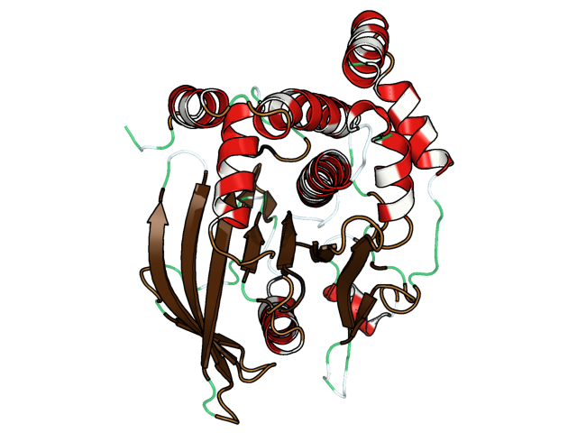

# 🍬 SweetTooth

[](https://doi.org/10.5281/zenodo.22900769)

<p align="center">
  
</p>

<p align="center">
  <b>Making protein secondary structure a little sweeter. 🍭</b>
</p>

[](#)
[](#)
[](#)
[](LICENSE)

</div>

---

## Overview

**SweetTooth** is an interactive visualization plugin for **PyMOL** that maps raw **DSSP secondary-structure assignments** onto a clean, food-inspired molecular representation.

The design goal is simple: keep the familiar modern PyMOL cartoon, preserve the scientific geometry, and add a visual language that makes different secondary-structure states easier to distinguish at a glance.

SweetTooth does **not** replace the protein structure. The original protein remains available for normal PyMOL operations such as rotation, selection, measurement, editing, trajectory playback, simulation workflows, and saving.

SweetTooth also does **not** generate images automatically or modify the original structure/DSSP files.

---

## ✨ Visual language

SweetTooth keeps PyMOL's modern cartoon representation and applies a restrained food-inspired style to each DSSP state.

| DSSP state | SweetTooth representation | Visual character |
|---|---|---|
| **H / G / I** | 🍭 **Candy cane helix** | Modern red cartoon helix with dense white stripe accents |
| **E / B** | 🍫 **Chocolate wafer** | Chocolate-brown β-sheet/cartoon ribbon |
| **C** | 🪱 **Gummy worm** | Smooth translucent green coil |
| **S** | ☁️ **Marshmallow rope** | Pale soft-looking bend |
| **T** | 🥨 **Soft pretzel** | Warm brown turn with natural cartoon curvature |
| **P** | 🖤 **Licorice twist** | Dark, firm-looking PPII styling |

The food identity comes mainly from **color, material, and the native cartoon geometry** rather than bulky decorative objects.

> **Design principle:** SweetTooth decorates the protein cartoon instead of replacing it.

---

## 🧬 Why SweetTooth?

Conventional secondary-structure coloring is effective, but different states can become visually repetitive in large proteins or trajectory analysis.

SweetTooth introduces a more memorable visual vocabulary while preserving the underlying scientific interpretation:

- modern PyMOL cartoon geometry remains intact
- DSSP assignments remain the source of truth
- the original protein object is preserved
- only SweetTooth-generated objects use the `STF_` prefix
- `sweettooth_reset` removes only SweetTooth objects
- no images are generated automatically
- no structure files are modified

---

## 📦 Installation

### Install from the wheel

```bash
python -m pip install --upgrade --force-reinstall \
  sweettooth_pymol-1.1.1-py3-none-any.whl
```

Launch PyMOL using the packaged entry point:

```bash
sweettooth-pymol
```

The launcher starts the system PyMOL interpreter and loads SweetTooth automatically.

### Optional system installation

SweetTooth can also be installed into a system PyMOL startup directory:

```bash
sudo "$(command -v sweettooth-install)" \
  --pymol-path /usr/share/pymol \
  --force
```

`--pymol-path` may point either to:

- a PyMOL root containing `data/startup`, or
- the PyMOL startup directory itself

Administrator privileges may be required for system-wide installation.

---

## 🚀 Quick start

SweetTooth uses **DSSP** assignments. Make sure `mkdssp` is available on your `PATH`.

From the PyMOL command line:

```text
sweet_load /absolute/path/to/protein.pdb
```

Example:

```text
sweet_load /home/user/proteins/example.pdb
```

SweetTooth will:

1. run `mkdssp` in a temporary directory
2. parse the DSSP assignments
3. map them back to the protein
4. create the SweetTooth visualization
5. leave the source structure untouched

---

## Loading an existing DSSP file

If DSSP assignments have already been calculated:

```text
load /absolute/path/to/protein.pdb, protein
sweettooth_load /absolute/path/to/assignments.dssp, dssp
sweettooth protein
```

---

## 🎬 Molecular-dynamics trajectories

SweetTooth supports frame-wise DSSP visualization for trajectories.

Generate DSSP with GROMACS:

```bash
gmx dssp \
  -s md.gro \
  -f md.xtc \
  -o md_dssp.dat \
  -num md_dssp.xvg \
  -hmode dssp \
  -clear
```

### GRO/XTC route

```text
sweet_load_md md.gro, md.xtc, md_dssp.dat, MD, 1, 100
```

### Multi-model PDB route

For PyMOL installations where native XTC handling is unstable, export a protein-only multi-model PDB and use:

```text
sweet_load_md_pdb md_protein.pdb, md_dssp.dat, MD, 1, 100
```

SweetTooth updates the DSSP-based coloring and geometry across frames while keeping the underlying trajectory object available.

---

## 🛠 Commands

```text
sweet_load path [, object [, auto|dssp]]

sweet_load_md gro_path, xtc_path, dssp_dat_path \
  [, object [, stride [, max_frames]]]

sweet_load_md_pdb pdb_trajectory, dssp_dat_path \
  [, object [, stride [, max_frames]]]

sweettooth_load path [, dssp]

sweettooth object [, force]

sweettooth_residue residue
sweettooth_residue chain, residue

sweettooth_status
sweettooth_reset
```

### Useful examples

```text
sweettooth_status
```

Reports the active object, number of mapped residues, DSSP records, and trajectory frames.

```text
sweettooth_residue A, 215
```

Reports the DSSP state assigned to a specific mapped residue.

```text
sweettooth_reset
```

Removes SweetTooth-generated objects and restores the original protein cartoon.

---

## 🧪 Scientific interpretation

SweetTooth is a **visualization layer**, not a secondary-structure predictor.

The structural state shown for each residue comes from DSSP assignments supplied by the user or generated through `mkdssp`.

The food-inspired representation is intended to improve visual readability and communication. It should not be interpreted as an independent physical or energetic classification.

---

## 🧱 Object safety

SweetTooth creates visualization objects using the prefix:

```text
STF_
```

This makes cleanup predictable and prevents accidental deletion of unrelated PyMOL objects.

Running:

```text
sweettooth_reset
```

removes only SweetTooth-generated objects and restores the source protein display.

---

## Compatibility

SweetTooth is designed for:

- **Python 3.8+**
- modern PyMOL builds
- `mkdssp` available on `PATH`
- Linux-focused installation workflows

The package also includes a narrowly scoped compatibility shim for older PyMOL lighting plugins that pass floating-point values into newer PyQt slider APIs.

Normal PyMOL commands remain available while SweetTooth is active.

---

## 📁 Package structure

```text
sweettooth_final/
├── plugin.py        # PyMOL commands and visualization logic
├── launcher.py      # packaged PyMOL launcher
├── installer.py     # optional startup-directory installer
└── runtime/         # narrowly scoped compatibility helpers
```

---

## 🗺 Roadmap

SweetTooth currently focuses on DSSP-driven secondary-structure visualization.

A new interactive structural-visualization feature is under development and will extend the ways structural information can be explored directly inside PyMOL.

**More details coming soon. 🍬**

---

## 🧾 Citation

If SweetTooth contributes to a scientific publication, presentation, or software workflow, please cite the repository and release version used.

A formal software citation will be added with the first archived release.

---

## Contributing

Issues, bug reports, compatibility reports, and feature suggestions are welcome.

When reporting a PyMOL compatibility issue, please include:

- operating system
- PyMOL version
- Python version
- installation method
- the complete PyMOL console error
- a minimal structure/DSSP example when possible

---

## 📄 License

SweetTooth is released under the **MIT License**.

Copyright © 2026 **Soumyadeep Ray**.

See [`LICENSE`](LICENSE) for details.

---

## Trademark notice

SweetTooth is an independent open-source visualization plugin and is **not affiliated with, sponsored by, or endorsed by Schrödinger, LLC**.

**PyMOL is a trademark of Schrödinger, LLC.** The PyMOL name is used only to identify software compatibility.

No official PyMOL logo, artwork, or other Schrödinger branding is bundled with SweetTooth.

---

<div align="center">

### 🍬 SweetTooth

**Secondary structure, with a little more flavor.**

</div>
